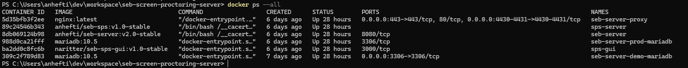

.. _prodsetup-label:

Production Setup
----------------

**Info:**

For production we provide currently two different default setups or examples, a fully bundled setups and one
as an example for a cloud based setup with kubernetes kind example configurations.

.. note::
    There is a new SEB Server setup approach since SEB Server version 1.2 where the docker image is not part of the setup repository
    anymore but is built and published by the main SEB Server repository within docker hub.

    And since SEB Server version 2.0 there are two new services that are included within the SEB Server installation but
    simplified setup process completely based on Docker-Compose for bundled setups, pulling images from Dockerhub.

    If you already have a SEB Server installation and want to migrate from a former installation with major version 1.X
    to the new major version 2.x, please consult the Major Version Migration Guide
    
The bundled setup currently uses dedicated port mapping. Therefore it needs to have at least three different ports open and
available to connect to from the Internet. This is usually the default SSL port 443 and two other ports that can also be used
for HTTPS like 4431 and 4432. This is needed because the two new services has their own API and accessible over HTTPS on 
the available DNS endpoint. 

.. note::
    We are currently working on a solution that uses URL path routing instead of port mapping but unfortunately this seems to be
    the usual case for a docker packed NodeJS/Vue service and currently we are still trying to find a solution with URL path 
    routing that covers all your needs and features

.. _bundledsetup-label:

Bundled Setup with dedicated Port mapping
...............................

This is the preferred way to setup a bundled SEB Server instance where all components run together within
the same machine or host and within the same docker network.
A simple and integrated MariaDB setup that uses just the official MariaDB Docker image, and a reverse proxy using the official nginx:latest Docker image. 
This setup uses docker compose to build and run all needed containers. The docker image for SEB Server is been downloaded from docker hub.

::

        installation strategy sub-directory.........docker/prod/bundled/
        seb-server configuration....................docker/prod/bundled/config/spring
        maria-db configuration......................docker/prod/bundled/config/mariadb
        reverse-proxy configuration.................docker/prod/bundled/config/nginx
        jmx configuration...........................docker/prod/bundled/config/jmx
        single server setup.........................yes
        secured (TLS)...............................configurable (needs own TLS certificates)
        integrated mariadb service..................yes (can be configured to connect to external DB)
        initial data setup..........................auto generated Institution and SEB Administrator
        data setup on reload........................Spring - Flyway migration setup
        integrated reverse proxy....................yes, with separated Port mapping for new services
        recommended machine requirements............CPU: x86_64/4 Cores/2-3 GHz, Mem 32GB, Disk Space min 100GB
        
**Requirements:**

- Git installation if not already installed
- Docker installation if not already installed

.. note::

    The newest versions of Git and Docker are recommended. For installation see:
        |    - Git : https://www.atlassian.com/git/tutorials/install-git
        |    - Docker : https://docs.docker.com/install/
        |    - Docker-Compose : https://docs.docker.com/compose/install/
        
**Setup:**

This setup contains a docker-compose.yml file that orchestrates the setup of the needed containers/services and a configuration sub-directory
for all needed components. The docker image for SEB Server will be automatically fetched from docker-hub.
For MariaDB the official public image is used to build-up the MariaDB server service.
The setup also contains a .env File that contains all settings that needs to be set to run with the default configuration.

**Configuration**

The configuration for each service is located in the local /config directory separated by folders for each concern. The "spring" folder
contains all the Spring and Spring-Boot based configurations and is used by the seb-server service. The "mariadb" folder contains the
usual mariadb configuration file that is loaded from the seb-server-mariadb service on startup. The "nginx" folder contains a usual 
nginx reverse-proxy configuration and is used by the reverse-proxy service. The "jmx" folder contains JMX related configurations and is also
used by the seb-server service if JMX is enabled. 

For a reference of the base environment variables see: :ref:`baseenv-label` 

For more details on how to configure each service see :ref:`configuration-label`.

**Installation:**

1. Login to the target/remote host where the SEB Server demo shall be installed, on windows open a command or PowerShell, create a working directory and navigate into it.
    
 .. code-block:: bash
    
    $ mkdir sebserver
    $ cd sebserver
        
2. Get a clone of the seb-server-setup repository and navigate to the demo setup folder

 .. code-block:: bash
     
    $ git clone -b v1.1-latest https://github.com/SafeExamBrowser/seb-server-setup.git
    $ cd seb-server-setup/docker/prod/bundled/dockerhub/

3. Open the existing .env file and apply the needed settings for the setup as the .env file example shows:

.. glossary::
    
    SEBSERVER_PWD 
        - The SEB Server password is needed for various reasons. This password must be always the same and should be securely stored somewhere
    DB_SA_PWD
        - The super user password for the data base connection. If you don't want to use the super user to connect to database you need to configure this within the docker-compose file for all services that needs a database connection.
    DNS_NAME
        - The DNS name where your host is available from the Internet
    BASE_PORT
        - The default port for HTTP connection. Usually 443 that is default for HTTPS connections
    SPS_WEB_PORT
        - The additional open SSL port for the screen proctoring webservice API
    SPS_GUI_PORT
        - The additional open SSL port for the screen proctoring guiservice (graphical user interface)

.. note::
    The passwords must be given also when the service is stopped and restarted again. You can either let the .env file
    be within the installation directory as is. Or you can delete the .env file from the host and copy or create it again when
    an update or restart of the container is needed. Note that it is very important that the SEBSERVER_PWD do not change and the same
    SEBSERVER_PWD is used for updates and restarts as it was for the initial setup. Otherwise data will be lost due to encryption with
    unknown or incorrect passwords. The password should be in the responsibility of a system administrator and handled with appropriate care.

4. Go to the nginx configuration folder and put your own valid SSL certificates to the "cert" subdirectory. The integrated reverse proxy will then use this certificates to secure all given connection ports.
If you have changed the default ports in step 3. you must also change it for the reverse proxy by open the app.conf file and change the port settings there accordingly.

5. Pull the Docker images from Dockerhub

 .. code-block:: bash
    
    $ docker-compose pull

6. Start the services. If you want to give the needed password here instead within an .env file, you can add them as environment variables within the call

 .. code-block:: bash
    
    $ docker-compose up -d

or

 .. code-block:: bash
    
    $ SEBSERVER_PWD=somePassword DB_SA_PWD=passwordForDataBase docker-compose up -d 
        
7. Check if the containers are started and running. The output should look something like the following.
    
 .. code-block:: bash
    
    $ docker ps --all
    $ docker logs ${container name}
        

        
8. If there where no changes to the default configuration the SEB Server is now running on port 443/4431/4432 and can be accessed with a browser on http(s)://server-address
   There is one pre-configured institution and one user-account with SEB Server Administrator role to manage the server. 
   The username and generated password of the initial admin account can be found on the logs:

.. code-block:: bash
    
    $ docker logs seb-server

::
    
    [SEB SERVER INIT] ---->   ___  ___  ___   ___
    [SEB SERVER INIT] ---->  / __|| __|| _ ) / __| ___  _ _ __ __ ___  _ _ 
    [SEB SERVER INIT] ---->  \__ \| _| | _ \ \__ \/ -_)| '_|\ V // -_)| '_|
    [SEB SERVER INIT] ---->  |___/|___||___/ |___/\___||_|   \_/ \___||_|  
    [SEB SERVER INIT] ---->
    [SEB SERVER INIT] ----> SEB Server successfully started up!
    ...
    [SEB SERVER INIT] ----> ***********************************************************************************************************************************************************************
    [SEB SERVER INIT] ----> SEB Server initial admin-account; name: sebserver-admin, pwd: i![qt}O3mUrCAA7WSZj5`ETRb4kfiy+za_IepZgnBCc^Br9=B%7lWXwcVABOAPJA
    [SEB SERVER INIT] ---->
    [SEB SERVER INIT] ----> !!!! NOTE: Do not forget to login and reset the generated admin password immediately !!!!
    [SEB SERVER INIT] ----> ***********************************************************************************************************************************************************************

For a complete initial log guide pleas read: :ref:`logguide-label`

.. note::
    We highly recommend to change the generated password from the initial admin account immediately after first login. 

.. _installkind-label:

Cloud based Kubernetes Kind Example
........................

This setup provides an example for a distributed and scalable cloud setup with Kubernetes and Kind.
You can use this as a staring point or template for a Kubernetes based production ready setup.

.. note::
    Kubernetes secrets should never get into Git unencrpyted. This is only an example.
    One solution to encrypt secrets for Git and decrypt it during deployment into the
    cluster is [SealedSecrets](https://github.com/bitnami-labs/sealed-secrets).

::

**Requirements:**

- kind: https://kind.sigs.k8s.io/docs/user/quick-start/#installing-from-release-binaries
- kubectl: https://kubernetes.io/docs/tasks/tools/
- kustomize: https://github.com/kubernetes-sigs/kustomize/releases

Kind, kubectl and kustomize can be installed as binaries so that they are available in the CLI console

.. note::
    Kind = Kubernetes In Docker. So this will work as a kubernetes cluster within a docker-container.

**Setup:**

The example setup consists of some kind setup descriptors, the kustomization.yaml and a deploy script.
The kustomization.yaml file first sets common values which are modified most: image version and replica count.
It then uses the base config published in this repository (docker/ethz/cloud/kustomize/) and extends it to a demo deployment.

**Configuration**

The configuration for each service is located in docker/ethz/cloud/kustomize/config/ directory separated by folders for each service.
The different services are webservice, guiservice and mariadb. This corresponds to the three kubernetes services that are setup by this demo.
Each service configuration folder contains then separate configuration folder for each individual concern of the service.
"spring" folder contains all the Spring and Spring-Boot based configurations and the jmx folder contains configuration for JMX binding (experimental)

For a reference of the base environment variables see: :ref:`baseenv-label` 

.. note::
    If you need TLS encryption which is specific to your setup environment, please refer to https://cert-manager.io/docs/
    There are also some commented placeholder for certificate handling within the file: ingress.yml within the example

**Installation:**

1. Login to the target/remote host where the SEB Server demo shall be installed, on windows open a command or PowerShell, create a working directory and navigate into it.

 .. code-block:: bash

    $ mkdir sebserver
    $ cd sebserver

2. Get a clone of the seb-server-setup repository and navigate to the demo setup folder

 .. code-block:: bash
    
    $ git clone https://github.com/SafeExamBrowser/seb-server-setup.git -b v1.4-latest
    $ cd seb-server-setup/docker/prod/cloud/kind-example

3. If some specific configuration is needed, this can be done within this step. See :ref:`configuration-label` for more details on how to configure the services.
Spring based configuration settings can be set either in the respective application-prod.properties files in docker/ethz/cloud/kustomize/config/
or via override in docker/demo/cloud/kind-example/kustomization.yml within the respective service.

.. note::
    The spring property names can be override in the respective yml by change the "." separator with a "_" separator.

4. Create the docker-container with the Kubernetes cluster and initialize Ingress.

- Linux: exec kind_deploy.sh

 .. code-block:: bash
    
    $ .\kind_deploy

- Windows:

 .. code-block:: bash
    
    $ kind create cluster --config=kindcluster.yaml
    $ kubectl apply -f https://raw.githubusercontent.com/kubernetes/ingress-nginx/master/deploy/static/provider/kind/deploy.yaml

Now you should be able to show the Ingress pods:

 .. code-block:: bash
    
    $ kubectl get pods -n ingress-nginx

5. Create a namespace for the services:

 .. code-block:: bash
    
    $ kubectl create ns seb-server-prod

6. Build the services from the template:

 .. code-block:: bash
    
    $ kustomize build . | kubectl apply -f -

.. note::
    If there is an error on the kustomize startup, make shure the ingress has already started propperly by using: $ kubectl get pods -n ingress-nginx
    and try again to run the kustomize template.

Now you should be able to show the services, pods and logs with:

 .. code-block:: bash
    
    $ kubectl get pods -n seb-server-prod
    $ kubectl get svc -n seb-server-prod
    $ kubectl logs seb-guiservice-prod-[f45588cfc-4944h] -n seb-server-prod

8. If there where no changes to the default configuration the SEB Server is now running on port 80 and can be accessed with a browser on http(s)://server-address
   There is one pre-configured institution and one user-account with SEB Server Administrator role to manage the server.
   The username and generated password of the initial admin account can be found on the webservice logs:

::

    [SEB SERVER INIT] ---->   ___  ___  ___   ___
    [SEB SERVER INIT] ---->  / __|| __|| _ ) / __| ___  _ _ __ __ ___  _ _
    [SEB SERVER INIT] ---->  \__ \| _| | _ \ \__ \/ -_)| '_|\ V // -_)| '_|
    [SEB SERVER INIT] ---->  |___/|___||___/ |___/\___||_|   \_/ \___||_|
    [SEB SERVER INIT] ---->
    [SEB SERVER INIT] ----> SEB Server successfully started up!
    ...
    [SEB SERVER INIT] ----> ***********************************************************************************************************************************************************************
    [SEB SERVER INIT] ----> SEB Server initial admin-account; name: sebserver-admin, pwd: i![qt}O3mUrCAA7WSZj5`ETRb4kfiy+za_IepZgnBCc^Br9=B%7lWXwcVABOAPJA
    [SEB SERVER INIT] ---->
    [SEB SERVER INIT] ----> !!!! NOTE: Do not forget to login and reset the generated admin password immediately !!!!
    [SEB SERVER INIT] ----> ***********************************************************************************************************************************************************************

.. note::
    We highly recommend to change the generated password from the initial admin account immediately after first login.

9. You can delete the whole kind cluster with:

 .. code-block:: bash
    
    $ kind delete cluster

.. _baseenv-label:

Base environment variables for services
.............................................

**Base environment variables sebserver webservice**

_________________________________________________________________________________________________________________

.. glossary::
    
    JAVA_HEAP_MIN 
        - Minimum heap memory space given to the JVM process
    JAVA_HEAP_MAX
        - Maximum heap memory space given to the JVM process
    sebserver_password
        - SEB Server internal password for encryption. NOTE: This password must be the same vor all webservice and gui instances
    spring_profiles_active 
        - SEB Server profiles. For a productive webservice setup "ws,prod-ws,prod"
    spring_datasource_password 
        - password for MariaDB database
    spring_datasource_username 
        - MariaDB user name
    datastore_mariadb_server_address 
        - MariaDB server hostname
    datastore_mariadb_server_port 
        - MariaDB port
    sebserver_webservice_http_external_scheme 
        - Webservice external URL scheme (http/https)
    sebserver_webservice_http_external_servername 
        - Webservice external URL host name
    sebserver_webservice_http_external_port 
        - Webservice external URL port (empty for default http(80) https(443))
    sebserver_webservice_autologin_url 
        - External URL from where the sebserver guiservice is available. See also `sebserver_gui_http_external_servername`
    sebserver_feature_exam_seb_screenProctoring_bundled_url 
        - The URL on which the screen proctoring webservice is externally available
    sps_sebserver_client_secret 
        - SEB Servers client secret to connect to screen proctoring service. This must match with the sebserver_client_secret setting in screen proctoring (sps) webservice
    sps_sebserver_password 
        - SEB Servers screen proctoring service maintenance account password. This must match with the same setting in screen proctoring (sps) webservice

**Base environment variables sebserver guiservice**

_________________________________________________________________________________________________________________

.. glossary::
    
    JAVA_HEAP_MIN 
        - Minimum heap memory space given to the JVM process
    JAVA_HEAP_MAX 
        - Maximum heap memory space given to the JVM process
    sebserver_password 
        - SEB Server internal password for encryption. NOTE: This password must be the same vor all webservice and gui instances
    spring_profiles_active 
        - SEB Server profiles. For a productive guiservice setup "gui,prod-gui,prod"
    sebserver_gui_http_external_scheme 
        - Guiservice external URL scheme (http/https)
    sebserver_gui_http_external_servername 
        - Guiservice external URL host name
    sebserver_gui_http_external_port 
        - Guiservice external URL port (empty for default http(80) https(443))
    sebserver_gui_http_webservice_scheme 
        - Webservice external connection URL scheme (http/https)
    sebserver_gui_http_webservice_servername 
        - Webservice external connection URL host name.
    sebserver_gui_http_webservice_port 
        - Webservice external connection URL port (empty for default http(80) https(443))

**Base environment variables screen proctoring (sps) webservice**

_________________________________________________________________________________________________________________

.. glossary::
    
    JAVA_HEAP_MIN 
        - Minimum heap memory space given to the JVM process
    JAVA_HEAP_MAX 
        - Maximum heap memory space given to the JVM process
    sebserver_password 
        - SEB Server internal password for encryption. NOTE: This password must be the same vor all webservice and gui instances
    spring_profiles_active 
        - SEB Server profiles. For a productive webservice setup "prod"
    spring_datasource_password 
        - password for MariaDB database
    spring_datasource_username 
        - MariaDB user name
    datastore_mariadb_server_address 
        - MariaDB server hostname
    datastore_mariadb_server_port 
        - MariaDB port
    sps_data_store_adapter 
        - Image (Screenshots) data store adapter. "FULL_RDBMS" for storing images into DB or "S3_RDBMS" for S3 compatible storage
    sps_webservice_http_external_scheme 
        - Webservice external URL scheme (http/https)
    sps_webservice_http_external_servername 
        - Webservice external URL host name
    sps_webservice_http_external_port 
        - Webservice external URL port (empty for default http(80) https(443))
    sps_gui_redirect_url 
        - SPS GUI external URL used for redirect and autologin link creation
    sebserver_client_secret 
        - Client secret for SEB Server binding. SEB Server must use this to connect to screen proctoring service. See also sps_sebserver_client_secret
    spsgui_client_secret 
        - Client secret for screen proctoring GUI service binding. SPS GUI service must use this to connect to the SPS webservice
    sps_init_sebserveraccount_password 
        - Password for the SEB Server user account that is used by SEB Server to manage SPS service data. This account is initially generated by the SPS service if it doesn't exist

**Base environment variables sebserver screen proctoring (sps) guiservice**

_________________________________________________________________________________________________________________

.. glossary::
    
    NODE_ENV 
        - Node environment profile. "prod" for production setup
    LOG_LEVEL
        - Log level. Default is "info"
    SERVER_PORT 
        - Internal service port mapping. Default is "3000"
    VITE_SERVER_URL 
        - The external URL of the VITE server
    VITE_SERVER_PORT 
        - The port mapping for above VITE server URL if needed. If not needed (default ports http/https) this can be empty
    PROCTOR_SERVER_URL 
        - The external URL of the screen proctoring webservice. This can also be internal URL connection to sps-webservice
    PROCTOR_SERVER_PORT 
        - Port mapping for above screen proctoring webservice URL if needed. If not needed (default ports http/https) this can be empty
    PROCTOR_DEFAULT_URL 
        - Default webservice root API endpoint. Usually "/admin-api/v1"
    PROCTOR_SERVER_USERNAME 
        - Client id name for sps-guiservice to connect to sps-webservice. Default is "spsGuiClient"
    PROCTOR_SERVER_PASSWORD 
        - Client secret for sps-guiservice to connect to sps-webservice. Must match with spsgui_client_secret
    SEB_SERVER_INTEGRATED_MODE 
        - Integration mode. Default is true
