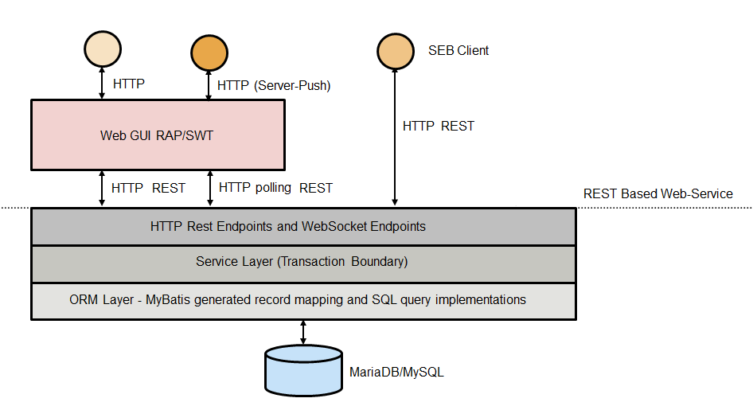
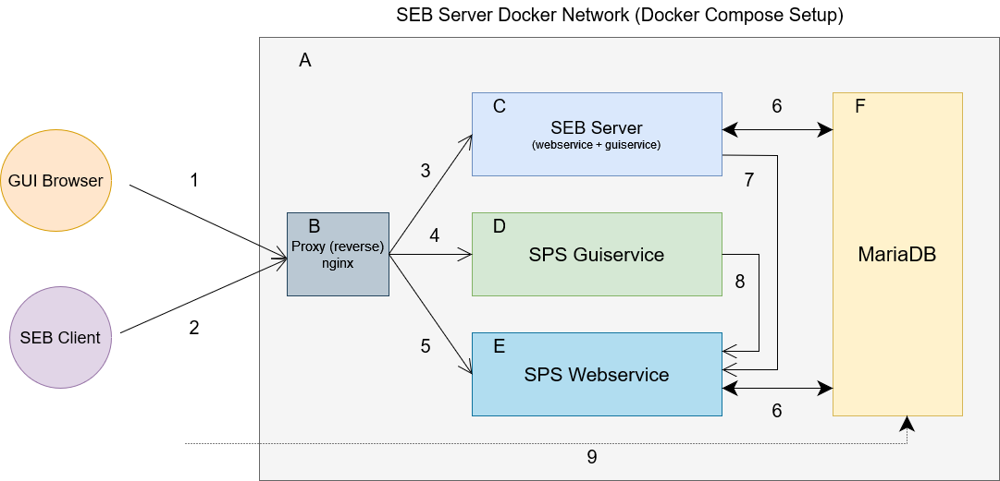
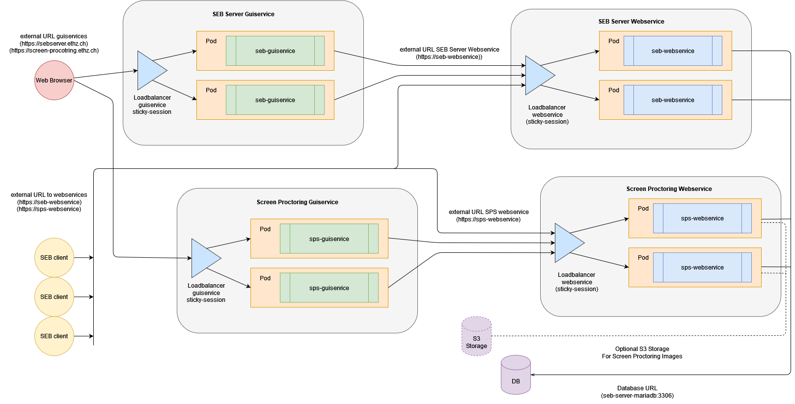

Installation Overview
=====================

Overall Architecture
--------------------

SEB Server is an enterprise server application consisting of several services mostly written in Java and uses `Spring <https://spring.io/>`_
and Spring Boot as a main-framework but also NodeJS and Vue framework for graphical user interface components.

The image below shows the overall architecture of the SEB Server which is basically split into two main parts, 
a webservice and a Graphical User Interface (GUI) service. This two services can be deployed together in one server 
instance or they can be deployed separately with the ability to scale the webservice for example up to the specified needs.

    
The webservice uses a well defined REST API interface over HTTP and mainly JSON as a data structure for communication. 
The webservice also implements OAuth2 as a standard authorization and authentication method.

The GUI service is written in Java and uses `Eclipse RAP <https://www.eclipse.org/rap/>`_ to create the HTML front-end and connect to and uses the REST API of 
the webservice. While the webservice has no user-session based state and externalize state as much as possible (except some internal caching) to make horizontal 
scaling possible, the GUI service has a session-state for the logged in users as it comes with the RAP framework.

In Version 2.X of SEB Server there are two additional services for the new screen proctoring feature. The two services are
separated webservice API and graphical user interface service just like the existing sebserver services. The separation is due
to the needed possibility to individually scale each component when needed or separate data bases for SEB Server and
screen proctoring since screen proctoring needs much more disk space when used.

There are basically two different setups for SEB Server. One that bundles all up to run SEB Server on one dedicated host
including or excluding data storage. And a cloud based setup where each service runs individually and also can be scaled
individually. For both setups a setup example and sample configuration are provided by this guide.

The image below shows a fully bundled setup were all is fit together within one Docker-Compose setup and a Docker Network

**Services: A - F**

- **A**: Docker Compose / Network on Host Server. This is been created with the given docker-compose.yml configuration
- **B**: Reverse Proxy with TLS termination for production and internal service routing
- **C**: SEB Server service container (Java / Spring Boot). This service bundles seb-webservice and seb-guiservice together since the GUI is also in Java. With next major version 3.0 this might change
- **D**: Screen Proctoring guiserrvice container (NodeJS/Vue). Connects to SPS Webservice for Maintenance and Proctoring
- **E**: Screen Proctoring werbservice container (Java / Spring Boot). Screen Proctoring Maintenance API, SEB Client Session and Screen Shot API and GUI Proctoring API
- **F**: Maria DB Server container. Can also be external if an external DB Server is used. SEB Server- and SPS Webservice need a connection to the DB server and each creates DB schema for itself. It is also possible ot have two different DB server for SEB Server and SPS Webservice.

**Connections and Routing: 1 - 9**

- **1**: Browser application to access the SEB Server and SPS GUI on that respective URL. Usually SEB server is avialable unther the root URL https://example.com and the SPS Guiservice is avialable under https://example.com/gui-service/
- **2**: SEB Client connecting to SEB Server and SPS webservice. SEB Clients directly connect to webservices of SEB Server and Screen Proctoring. The Proxy makes the routing.
- **3**: Proxy routing SEB Server webservice and GUI traffic
- **4**: Proxy routing Screen Proctoring GUI requests to sps GUI service
- **5**: Proxy routing Screen Proctoring request to sps webservice
- **6**: Internal service to DB connection (external when DB is external)
- **7**: SEB Server connection to Screen Proctoring webservice. (this can be internal via docker network or external via DNS)
- **8**: Screen Proctoring GUI Service connection to the Screen Proctoring Webservice to apply to the Maintenance and Proctoring API of the Webservice. (this can be internal via docker network or external via DNS)
- **9**: Optional exposed connection to the MariaDB Server on port 3306

The following diagram shows cloud based setup where all services are setup separately running within scalable pods and
are externally connected within dedicated DNS names and URLs while an Ingress (or similar routing service) makes the
TLS termination and internal routing / load balancing to the running services.

.. _installation-repo-label:

Installation Repository
-----------------------

The installation and setup of SEB Server depends on the service needs and the local IT environment and infrastructure that exists 
and can be used. Because the setup can vary from a simple in-house all-in-one server setup to a setup that serves many institutions 
and must be horizontally scalable, the seb-server-setup repository contains pre-configured docker-based SEB Server setups for the most 
common cases and can easily be extended by adding new installation setups. 

The seb-server-setup repository structure contains different setups-configurations separated for the different needs. Currently only docker-based 
installations are supported. On the second directory level installation purpose categories like "demo" for setting up a 
SEB Server for demonstrations or "prod" for final productivity setup are defined. The third and forth directory level,
if existing, names then different SEB Server setups like "bundled", "cloud". Below is an example of the seb-server-setup directory structure.

At each endpoint (e.g.: docker/prod/bundled/basic/) there is a root installation directory with docker-files for the services, a docker-compose definition and a "config" directory
containing service related configurations like Spring configuration for the SEB Server, MariaDB configuration for the database and/or
reverse proxy configuration.

Bundled setups also comes with a .env File within the installation directory with the all the environment settings that
has to be set at least for the specific setup when it should be setup with all the default configuration defined by the example.
This usually are passwords, connection details and external DNS mapping settings.

