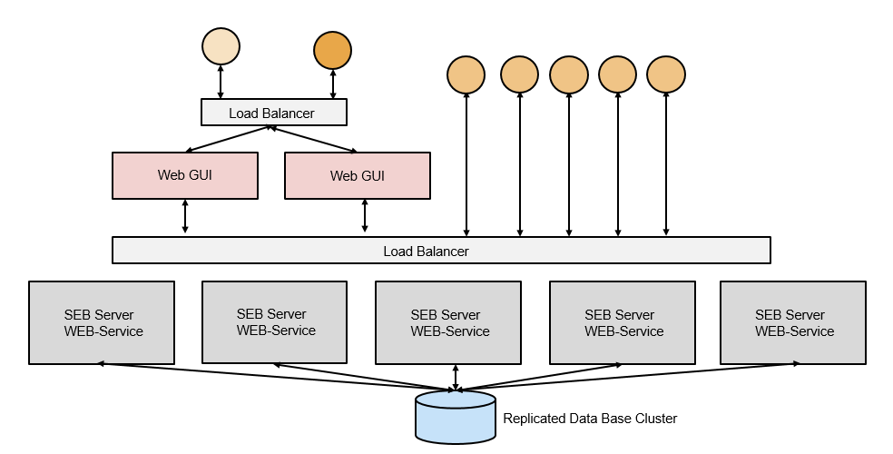

Installation Overview
=====================

Overall Architecture
--------------------

SEB Server is an enterprise server application written in Java and uses `Spring <https://spring.io/>`_ and Spring Boot as a main-framework. 

The image below shows the overall architecture of the SEB Server which is basically split into two main parts, 
a webservice and a Graphical User Interface (GUI) service. This two services can be deployed together in one server 
instance or they can be deployed separately with the ability to scale the webservice for example up to the specified needs.

.. image:: images/overall-architecture.png
    :align: center
    :target: https://raw.githubusercontent.com/SafeExamBrowser/seb-server-setup/master/docs/images/overall-architecture.png
    
The webservice uses a well defined REST API interface over HTTP and mainly JSON as a data structure for communication. 
The webservice also implements OAuth2 as a standard authorization and authentication method. 
The GUI service is written in Java and uses `Eclipse RAP <https://www.eclipse.org/rap/>`_ to create the HTML front-end and connect to and uses the REST API of 
the webservice. While the webservice has no user-session based state and externalize state as much as possible (except some internal caching) to make horizontal 
scaling possible, the GUI service has a session-state for the logged in users as it comes with the RAP framework.

The following diagram shows a setup with scaled web-services covered by a load balancer and a separated GUI service on top.
The web-services as well as the GUI service can run on the same host (but separated processes) or they can run in a cluster on different 
hosts / VM's.

.. note:: 

    A Fully clustered setup installation for SEB Server is not yet part of this documentation but it should be possible to
    achieve this with a docker based cluster service like `docker-swarm <https://docs.docker.com/engine/swarm/>`_ or `Kubernetes <https://kubernetes.io/docs/concepts/>`_ 
    and with the given configuration and setup parts.

.. _installation-repo-label:

Installation Repository
-----------------------

The installation and setup of SEB Server depends on the service needs and the local IT environment and infrastructure that exists 
and can be used. Because the setup can vary from a simple in-house all-in-one server setup to a setup that serves many institutions 
and must be horizontally scalable, the seb-server-setup repository contains pre-configured docker-based SEB Server setups for the most 
common cases and can easily be extended by adding new installation setups. 

The seb-server-setup repository structure contains different setups-configurations separated for the different needs. Currently only docker-based 
installations are supported. On the second directory level installation purpose categories like "demo" for setting up a 
SEB Server for demonstrations, "testing" or "prod" for testing purposes or final productivity setup are defined. The third and forth directory level, 
if existing, names then different SEB Server setups like "bundled", "basic", "tls" or "distributed". Below is an example of the seb-server-setup directory structure. 

::
    
    - docker
    
        - demo
            [a basic bundled test setup]
        - prod
            - bundled
                - basic
                    [basic bundled setup]
                - tls
                    [bundled setup with tls endpoint]
          - distributed
                [not yet available]

        - testing
            - basic
                [a basic bundled stup of testing]
            - tls 
                [experimental]
        - ..?
      
At each endpoint there is a root installation directory with docker-files for the services, a docker-compose definition and a "config" directory
containing service related configurations like Spring configuration for the SEB Server, MariaDB configuration for the database and/or
reverse proxy configuration.

